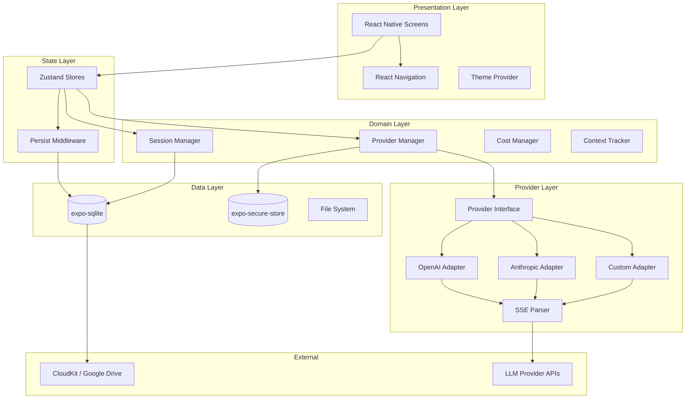
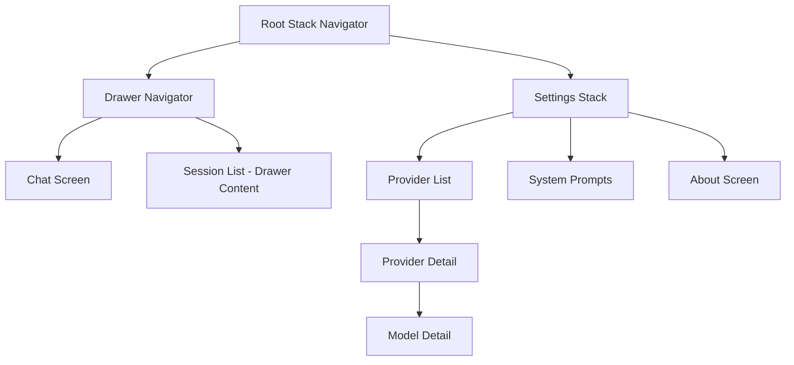
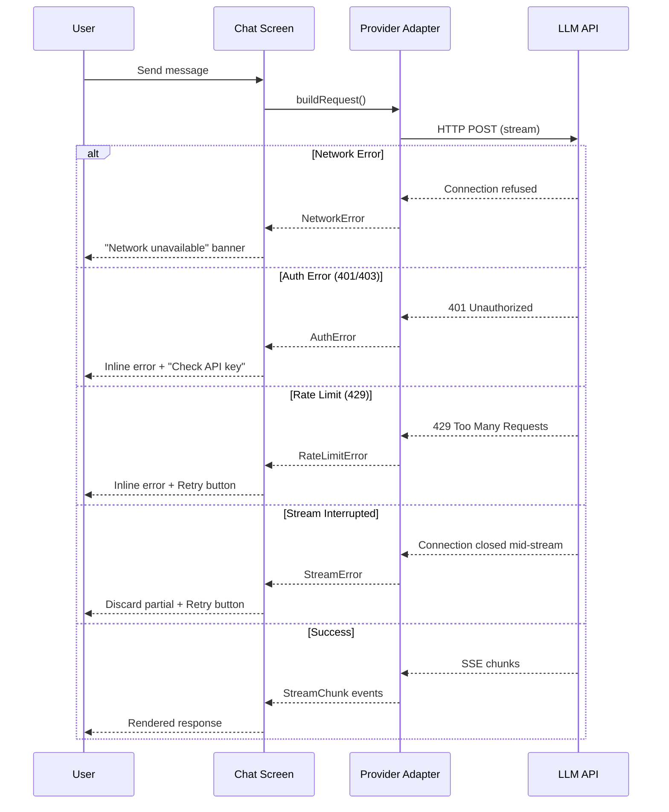

# Design Document: Arlo Lite App

## Overview

Arlo Lite is a free, open-source React Native mobile application that serves as a lightweight LLM client. Users bring their own API keys and communicate directly with LLM providers (OpenAI, Anthropic, or any OpenAI-compatible endpoint) without any intermediary backend. All data is persisted locally on-device with optional cloud backup for cross-device continuity.

### Key Design Decisions

| Decision | Choice | Rationale |
|----------|--------|-----------|
| Framework | Expo (managed workflow) | Simplified builds, OTA updates, native module access via expo-sqlite, expo-secure-store, expo-speech |
| State Management | Zustand with persist middleware | Minimal boilerplate, excellent TypeScript support, async storage integration |
| Local Database | expo-sqlite | First-party Expo support, WAL mode, migration-friendly, no native linking hassles |
| Secure Storage | expo-secure-store | iOS Keychain / Android Keystore backed, integrates seamlessly with Expo |
| Navigation | React Navigation 7+ (Drawer + Stack) | Mature ecosystem, TypeScript-first, deep linking support |
| Markdown Rendering | react-native-markdown-display + react-syntax-highlighter | Active maintenance, supports code blocks with syntax highlighting |
| Streaming | Custom SSE parser per provider | Providers differ in SSE format; a shared interface with per-provider implementations is cleanest |
| Cloud Backup | CloudKit (iOS) / Google Drive (Android) | Platform-native, no custom backend needed, user-controlled |
| i18n | i18next + react-i18next | Industry standard, lazy-loaded locale files, pluralization support |
| Testing | Jest + fast-check (PBT) | Jest for unit/integration, fast-check for property-based testing of provider logic |

## Architecture

### High-Level Architecture Diagram



### Layer Responsibilities

1. **Presentation Layer**: React Native components, navigation, theming, accessibility
2. **State Layer**: Zustand stores for reactive UI state, persist middleware for non-sensitive config
3. **Domain Layer**: Business logic for providers, sessions, cost calculation, context tracking
4. **Provider Layer**: Protocol adapters implementing the common Provider interface, SSE parsing
5. **Data Layer**: SQLite for structured data, Secure Store for API keys, file system for attachments

## Components and Interfaces

### Provider Interface (Core Abstraction)

```typescript
// src/providers/types.ts

export type ProviderType = 'openai' | 'anthropic' | 'custom';
export type OpenAIApiMode = 'responses' | 'chat-completions';
export type ThinkingLevel = 'off' | 'minimal' | 'low' | 'medium' | 'high' | 'xhigh';

export interface ProviderConfig {
  id: string;
  type: ProviderType;
  name: string;
  baseUrl: string;
  apiMode?: OpenAIApiMode; // Only for OpenAI type
  streamingEnabled: boolean;
  createdAt: number;
  updatedAt: number;
}

export interface ModelConfig {
  id: string;
  providerId: string;
  modelId: string;
  displayName: string;
  contextWindow: number | null;
  inputPrice: number | null;   // per million tokens
  outputPrice: number | null;  // per million tokens
  cachedInputPrice: number | null;
  cachedOutputPrice: number | null;
  supportsReasoning: boolean;
  supportsImageInput: boolean;
  supportsImageGeneration: boolean;
  supportsFileInput: boolean;
}

export interface ChatMessage {
  role: 'system' | 'user' | 'assistant';
  content: string | ContentPart[];
  thinkingContent?: string;
}

export type ContentPart =
  | { type: 'text'; text: string }
  | { type: 'image_url'; image_url: { url: string } };

export interface StreamChunk {
  type: 'text' | 'thinking' | 'done' | 'error';
  content: string;
  usage?: TokenUsage;
}

export interface TokenUsage {
  promptTokens: number;
  completionTokens: number;
  totalTokens: number;
  cachedTokens?: number;
}

export interface CompletionRequest {
  messages: ChatMessage[];
  model: string;
  thinkingLevel: ThinkingLevel;
  stream: boolean;
  maxTokens?: number;
}

export interface CompletionResponse {
  content: string;
  thinkingContent?: string;
  usage: TokenUsage;
  finishReason: string;
}

/**
 * Common Provider interface - all providers implement this.
 * Adding a new provider requires only implementing this interface.
 */
export interface IProvider {
  readonly type: ProviderType;

  /** Build the HTTP request for a completion */
  buildRequest(config: ProviderConfig, request: CompletionRequest): {
    url: string;
    headers: Record<string, string>;
    body: string;
  };

  /** Parse a non-streaming response */
  parseResponse(raw: unknown): CompletionResponse;

  /** Parse a single SSE line into a StreamChunk */
  parseStreamChunk(line: string): StreamChunk | null;

  /** Map abstract ThinkingLevel to provider-specific params */
  mapThinkingLevel(level: ThinkingLevel): Record<string, unknown>;

  /** List available models from the provider API */
  listModels(config: ProviderConfig, apiKey: string): Promise<string[]>;

  /** Validate API key with a minimal request */
  validateApiKey(config: ProviderConfig, apiKey: string): Promise<boolean>;
}
```

### SSE Stream Manager

```typescript
// src/providers/sse-manager.ts

export interface SSECallbacks {
  onChunk: (chunk: StreamChunk) => void;
  onComplete: (usage?: TokenUsage) => void;
  onError: (error: Error) => void;
}

export interface SSEConnection {
  abort: () => void;
}

export function createSSEStream(
  url: string,
  headers: Record<string, string>,
  body: string,
  provider: IProvider,
  callbacks: SSECallbacks
): SSEConnection;
```

### Session Manager

```typescript
// src/domain/session-manager.ts

export interface Session {
  id: string;
  title: string;
  providerId: string;
  modelId: string;
  systemPromptId: string | null;
  createdAt: number;
  updatedAt: number;
  totalCost: number;
  tokenCount: number;
}

export interface Message {
  id: string;
  sessionId: string;
  role: 'user' | 'assistant' | 'system';
  content: string;
  thinkingContent?: string;
  providerId: string;
  modelId: string;
  tokenUsage?: TokenUsage;
  cost?: number;
  createdAt: number;
}
```

### Zustand Store Architecture

```typescript
// Store slices (each in its own file)

// src/stores/provider-store.ts
interface ProviderStore {
  providers: ProviderConfig[];
  models: ModelConfig[];
  addProvider: (config: Omit<ProviderConfig, 'id' | 'createdAt' | 'updatedAt'>) => void;
  updateProvider: (id: string, updates: Partial<ProviderConfig>) => void;
  deleteProvider: (id: string) => void;
  addModel: (config: Omit<ModelConfig, 'id'>) => void;
  deleteModel: (id: string) => void;
}

// src/stores/session-store.ts
interface SessionStore {
  sessions: Session[];
  activeSessionId: string | null;
  messages: Record<string, Message[]>; // sessionId -> messages
  createSession: (providerId: string, modelId: string) => string;
  deleteSession: (id: string) => void;
  renameSession: (id: string, title: string) => void;
  addMessage: (sessionId: string, message: Omit<Message, 'id' | 'createdAt'>) => void;
}

// src/stores/chat-store.ts
interface ChatStore {
  isStreaming: boolean;
  streamContent: string;
  thinkingContent: string;
  activeProviderId: string | null;
  activeModelId: string | null;
  thinkingLevel: ThinkingLevel;
  setStreaming: (streaming: boolean) => void;
  appendStreamContent: (text: string) => void;
  setThinkingLevel: (level: ThinkingLevel) => void;
  switchModel: (providerId: string, modelId: string) => void;
}

// src/stores/settings-store.ts
interface SettingsStore {
  theme: 'light' | 'dark' | 'system';
  locale: string;
  defaultSystemPromptId: string | null;
  systemPrompts: SystemPrompt[];
  setTheme: (theme: 'light' | 'dark' | 'system') => void;
}
```

### Navigation Structure



## Data Models

### SQLite Schema

```sql
-- Database version tracking via PRAGMA user_version

-- Providers (API keys stored separately in Secure Store)
CREATE TABLE providers (
  id TEXT PRIMARY KEY,
  type TEXT NOT NULL CHECK(type IN ('openai', 'anthropic', 'custom')),
  name TEXT NOT NULL,
  base_url TEXT NOT NULL,
  api_mode TEXT CHECK(api_mode IN ('responses', 'chat-completions')),
  streaming_enabled INTEGER NOT NULL DEFAULT 1,
  created_at INTEGER NOT NULL,
  updated_at INTEGER NOT NULL
);

-- Models registered under providers
CREATE TABLE models (
  id TEXT PRIMARY KEY,
  provider_id TEXT NOT NULL REFERENCES providers(id) ON DELETE CASCADE,
  model_id TEXT NOT NULL,
  display_name TEXT NOT NULL,
  context_window INTEGER,
  input_price REAL,
  output_price REAL,
  cached_input_price REAL,
  cached_output_price REAL,
  supports_reasoning INTEGER NOT NULL DEFAULT 0,
  supports_image_input INTEGER NOT NULL DEFAULT 0,
  supports_image_generation INTEGER NOT NULL DEFAULT 0,
  supports_file_input INTEGER NOT NULL DEFAULT 0
);

-- Chat sessions
CREATE TABLE sessions (
  id TEXT PRIMARY KEY,
  title TEXT NOT NULL,
  provider_id TEXT NOT NULL REFERENCES providers(id),
  model_id TEXT NOT NULL REFERENCES models(id),
  system_prompt_id TEXT,
  total_cost REAL NOT NULL DEFAULT 0,
  token_count INTEGER NOT NULL DEFAULT 0,
  created_at INTEGER NOT NULL,
  updated_at INTEGER NOT NULL
);

CREATE INDEX idx_sessions_updated ON sessions(updated_at DESC);

-- Messages within sessions
CREATE TABLE messages (
  id TEXT PRIMARY KEY,
  session_id TEXT NOT NULL REFERENCES sessions(id) ON DELETE CASCADE,
  role TEXT NOT NULL CHECK(role IN ('user', 'assistant', 'system')),
  content TEXT NOT NULL,
  thinking_content TEXT,
  provider_id TEXT NOT NULL,
  model_id TEXT NOT NULL,
  prompt_tokens INTEGER,
  completion_tokens INTEGER,
  total_tokens INTEGER,
  cached_tokens INTEGER,
  cost REAL,
  created_at INTEGER NOT NULL
);

CREATE INDEX idx_messages_session ON messages(session_id, created_at ASC);

-- System prompts
CREATE TABLE system_prompts (
  id TEXT PRIMARY KEY,
  name TEXT NOT NULL,
  content TEXT NOT NULL,
  is_default INTEGER NOT NULL DEFAULT 0,
  created_at INTEGER NOT NULL,
  updated_at INTEGER NOT NULL
);

-- Metadata table cache (fetched from remote JSON)
CREATE TABLE model_metadata (
  model_id TEXT PRIMARY KEY,
  context_window INTEGER,
  input_price REAL,
  output_price REAL,
  cached_input_price REAL,
  cached_output_price REAL,
  supports_reasoning INTEGER NOT NULL DEFAULT 0,
  updated_at INTEGER NOT NULL
);

-- Sync tracking for cloud backup
CREATE TABLE sync_log (
  id TEXT PRIMARY KEY,
  table_name TEXT NOT NULL,
  record_id TEXT NOT NULL,
  action TEXT NOT NULL CHECK(action IN ('insert', 'update', 'delete')),
  synced INTEGER NOT NULL DEFAULT 0,
  created_at INTEGER NOT NULL
);
```

### Secure Storage Keys

```
arlo:provider:{providerId}:apiKey  -> encrypted API key string
```

### Cloud Backup Data Structure

```typescript
interface BackupPayload {
  version: number;
  exportedAt: number;
  providers: Omit<ProviderConfig, never>[]; // excludes API keys
  models: ModelConfig[];
  sessions: Session[];
  messages: Message[];
  systemPrompts: SystemPrompt[];
  settings: AppSettings;
}
```

## Project Folder Structure

```
src/
├── app/                        # Expo Router / entry point
│   └── _layout.tsx             # Root layout with providers
├── navigation/                 # React Navigation setup
│   ├── RootNavigator.tsx
│   ├── DrawerNavigator.tsx
│   └── SettingsNavigator.tsx
├── screens/                    # Screen components
│   ├── ChatScreen.tsx
│   ├── SessionListScreen.tsx
│   ├── SettingsScreen.tsx
│   ├── ProviderListScreen.tsx
│   ├── ProviderDetailScreen.tsx
│   ├── ModelDetailScreen.tsx
│   ├── SystemPromptsScreen.tsx
│   └── AboutScreen.tsx
├── components/                 # Reusable UI components
│   ├── chat/
│   │   ├── MessageBubble.tsx
│   │   ├── MessageInput.tsx
│   │   ├── StreamingIndicator.tsx
│   │   ├── ThinkingIndicator.tsx
│   │   ├── ModelSwitcher.tsx
│   │   ├── ThinkingLevelSelector.tsx
│   │   ├── ContextUsageBar.tsx
│   │   └── CodeBlock.tsx
│   ├── common/
│   │   ├── Button.tsx
│   │   ├── Card.tsx
│   │   ├── ErrorBanner.tsx
│   │   ├── LoadingSpinner.tsx
│   │   └── NetworkStatus.tsx
│   └── settings/
│       ├── ProviderCard.tsx
│       ├── ModelCard.tsx
│       └── ThemeSelector.tsx
├── providers/                  # Provider adapters (core abstraction)
│   ├── types.ts                # IProvider interface + shared types
│   ├── registry.ts             # Provider registry / factory
│   ├── openai/
│   │   ├── openai-provider.ts
│   │   ├── openai-responses.ts # Responses API specifics
│   │   └── openai-chat.ts      # Chat Completions API specifics
│   ├── anthropic/
│   │   └── anthropic-provider.ts
│   ├── custom/
│   │   └── custom-provider.ts
│   └── sse/
│       ├── sse-manager.ts      # Shared SSE connection logic
│       ├── openai-parser.ts
│       └── anthropic-parser.ts
├── stores/                     # Zustand stores
│   ├── provider-store.ts
│   ├── session-store.ts
│   ├── chat-store.ts
│   └── settings-store.ts
├── domain/                     # Business logic (pure functions)
│   ├── session-manager.ts
│   ├── cost-calculator.ts
│   ├── context-tracker.ts
│   ├── thinking-mapper.ts
│   └── token-estimator.ts
├── database/                   # SQLite layer
│   ├── database.ts             # DB initialization + migrations
│   ├── migrations/
│   │   └── v1.ts
│   ├── repositories/
│   │   ├── provider-repo.ts
│   │   ├── session-repo.ts
│   │   ├── message-repo.ts
│   │   └── system-prompt-repo.ts
│   └── secure-store.ts         # expo-secure-store wrapper
├── services/                   # Side-effect services
│   ├── backup-service.ts       # Cloud backup logic
│   ├── metadata-service.ts     # Fetch remote metadata table
│   └── network-monitor.ts      # Connectivity detection
├── i18n/                       # Internationalization
│   ├── index.ts                # i18next setup
│   └── locales/
│       ├── en.json
│       └── zh-TW.json
├── theme/                      # Theming
│   ├── colors.ts
│   ├── typography.ts
│   ├── spacing.ts
│   └── index.ts
├── hooks/                      # Custom React hooks
│   ├── useProvider.ts
│   ├── useChat.ts
│   ├── useNetwork.ts
│   └── useTheme.ts
├── utils/                      # Utility functions
│   ├── uuid.ts
│   ├── date.ts
│   └── clipboard.ts
└── constants/
    └── defaults.ts             # Default system prompt, URLs, etc.
```

## Correctness Properties

*A property is a characteristic or behavior that should hold true across all valid executions of a system — essentially, a formal statement about what the system should do. Properties serve as the bridge between human-readable specifications and machine-verifiable correctness guarantees.*

### Property 1: Provider request format correctness

*For any* valid provider configuration (OpenAI Responses, OpenAI Chat Completions, Anthropic, or Custom) and any non-empty message history, building a request through the corresponding provider adapter should produce a well-formed HTTP request body that conforms to that provider's API specification — correct endpoint path, required headers, and structurally valid JSON body.

**Validates: Requirements 4.1, 4.2, 4.3, 4.4**

### Property 2: Thinking level mapping correctness

*For any* combination of ThinkingLevel value (off, minimal, low, medium, high, xhigh) and provider type (OpenAI, Anthropic), the mapThinkingLevel function should produce the exact provider-specific parameters: for OpenAI "off" omits reasoning_effort; for Anthropic maps to the specified budget_tokens values (1024, 2048, 8192, 16384); and for any provider "xhigh" produces identical output to "high".

**Validates: Requirements 7.3, 7.4, 7.5, 7.6, 7.7, 7.8, 7.9**

### Property 3: SSE chunk parsing produces valid output

*For any* valid SSE event line from a supported provider, parsing it through the provider's SSE parser should produce either a valid StreamChunk (with type in {text, thinking, done, error} and non-empty content for text/thinking types), or null for non-content lines (comments, keep-alives, empty lines).

**Validates: Requirements 4.5, 8.1**

### Property 4: Cost calculation accuracy

*For any* token usage with non-negative promptTokens and completionTokens, and any non-negative input/output prices, the computed cost should equal (promptTokens × inputPrice + completionTokens × outputPrice) / 1_000_000, and the running session total should equal the sum of all individual message costs.

**Validates: Requirements 12.1, 12.2**

### Property 5: Context usage percentage is bounded

*For any* non-negative session token count and positive model context window size, the calculated context usage percentage should equal (tokenCount / contextWindow) × 100, and should always be within the range [0, ∞) without capping — but the UI indicator should clamp display to [0, 100].

**Validates: Requirements 11.2**

### Property 6: Token estimation is monotonic

*For any* non-empty string S, the character-based token estimation should produce a positive integer, and for any prefix P of S (where P is non-empty), estimate(P) ≤ estimate(S).

**Validates: Requirements 11.3**

### Property 7: Session title truncation

*For any* non-empty user message string M, the auto-generated session title T should satisfy: length(T) ≤ 50, T is a prefix of M (or T equals M if length(M) ≤ 50), and T is never empty.

**Validates: Requirements 5.2**

### Property 8: Message edit discards subsequent messages

*For any* session with N messages (N ≥ 2) and an edit at position K (where 1 ≤ K < N), after the edit operation the session should contain exactly K messages, preserving all messages at positions 1..K-1 and the new edited message at position K.

**Validates: Requirements 9.2**

### Property 9: Cascade deletion integrity

*For any* provider with M associated models (M ≥ 0), deleting the provider should result in zero models with that provider's ID remaining in the database. Similarly, for any session with N messages, deleting the session should result in zero messages with that session's ID remaining.

**Validates: Requirements 1.9, 5.5**

### Property 10: API keys exist only in secure storage

*For any* stored API key, it should be retrievable exclusively from Secure_Storage, and should never appear in: backup export payloads, Zustand persisted state, SQLite database rows, or any serializable application state.

**Validates: Requirements 3.1, 3.2, 3.3, 15.6**

### Property 11: Metadata lookup correctness

*For any* model ID string, if it exists in the Metadata_Table the lookup should return the exact context window and price values from the table; if it does not exist, the lookup should return null for all metadata fields.

**Validates: Requirements 2.2, 2.3**

### Property 12: Session list ordering

*For any* set of sessions with distinct updatedAt timestamps, the session list should be sorted in strictly descending order by updatedAt.

**Validates: Requirements 5.3**

### Property 13: Sync conflict resolution (last-write-wins)

*For any* two conflicting records with different updatedAt timestamps, the conflict resolver should always select the record with the later timestamp, regardless of other field values.

**Validates: Requirements 15.5**

### Property 14: Context never auto-truncated

*For any* message list in a session, regardless of total token count relative to context window size, the system should never automatically remove, shorten, or truncate any message.

**Validates: Requirements 11.4**

## Error Handling

### Error Categories

| Category | Source | User Impact | Handling |
|----------|--------|-------------|----------|
| Network | No connectivity | Cannot send messages | Show network indicator, disable send button |
| API Auth | Invalid/expired key | Request rejected | Show error in chat, suggest re-entering key |
| API Rate Limit | Provider throttling | Temporary failure | Show error with retry button, exponential backoff |
| API Server | Provider 5xx | Temporary failure | Show error with retry button |
| API Format | Unexpected response | Message lost | Show error, log response for debugging |
| Storage | DB write failure | Data loss risk | Retry with exponential backoff, alert user |
| Stream | Connection dropped | Partial message | Discard partial, show error with retry |

### Error Flow



### Error Display Pattern

1. **Compact**: One-line message inline in chat (e.g., "API error: Invalid API key")
2. **Expandable**: Tap to reveal full error detail (status code, response body)
3. **Actionable**: Retry button for transient errors, settings link for auth errors

## Testing Strategy

### Unit Tests (Jest)

- **Provider adapters**: Request building, response parsing for each provider type
- **Domain logic**: Cost calculation, context tracking, token estimation, thinking level mapping
- **Store actions**: State transitions in Zustand stores
- **Database repositories**: CRUD operations with in-memory SQLite
- **Components**: Render tests for key UI components

### Property-Based Tests (fast-check)

Property-based testing validates universal properties across many generated inputs. Each property test runs a minimum of 100 iterations with randomized inputs.

**Properties to implement**:

| # | Property | Key Generators |
|---|----------|---------------|
| 1 | Provider request format correctness | Random messages[], provider configs, model params |
| 2 | Thinking level mapping correctness | All ThinkingLevel × ProviderType combinations |
| 3 | SSE chunk parsing | Random valid SSE lines per provider format |
| 4 | Cost calculation accuracy | Random non-negative token counts, prices |
| 5 | Context usage percentage | Random token counts, positive window sizes |
| 6 | Token estimation monotonicity | Random strings and their prefixes |
| 7 | Session title truncation | Random strings of length 0–200 |
| 8 | Message edit discards subsequent | Random message lists (2–50), random edit positions |
| 9 | Cascade deletion integrity | Random providers with 0–20 models, sessions with 0–100 messages |
| 10 | API keys only in secure storage | Random key strings, backup exports, state snapshots |
| 11 | Metadata lookup correctness | Random model IDs, random metadata tables |
| 12 | Session list ordering | Random sessions with distinct timestamps |
| 13 | Sync conflict resolution | Random record pairs with different timestamps |
| 14 | Context never auto-truncated | Random message lists exceeding context window |

**Configuration**:
- Library: `fast-check`
- Minimum iterations: 100 per property
- Each test tagged: `Feature: arlo-lite-app, Property {N}: {property_title}`
- Each property implemented as a SINGLE property-based test function

### Integration Tests

- End-to-end provider communication with mock HTTP server
- SQLite migration execution and data integrity
- Cloud backup export/import cycle
- Navigation flow between screens

### Manual Testing

- Accessibility audit with VoiceOver/TalkBack
- Dark/light mode visual verification
- Streaming UX smoothness
- Offline mode behavior
