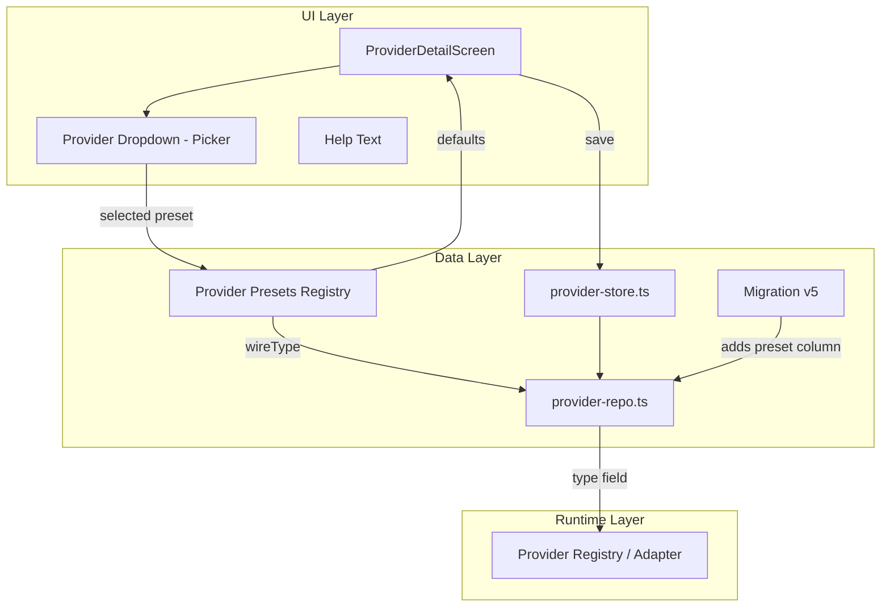

# Design Document: Custom Provider UX Improvements

## Overview

This feature replaces the 3-option segmented control (OpenAI / Anthropic / Custom) on the Provider Settings Screen with a full dropdown selector (Picker) listing 9 pre-defined provider presets. Each preset carries sensible defaults (base URL, reasoning mode, API key requirement) so users can configure services like Ollama, llama.cpp, vLLM, OpenRouter, Google Gemini, and AWS Bedrock with minimal manual entry.

The key design principle is **separation of identity from protocol**: a new `preset` field records *which service* the user chose (for UI display and defaults), while the existing `type` field continues to select the *SDK adapter* at runtime. This preserves full backward compatibility — the wire protocol layer sees no change.

### Goals

- Reduce friction for connecting local inference servers (Ollama, llama.cpp, vLLM)
- Make cloud provider gateways (OpenRouter, Bedrock, Gemini) first-class options
- Maintain backward compatibility with existing `ProviderType` union and adapters
- Keep the Provider_Settings_Screen consistent with iOS grouped-list conventions

### Non-Goals

- Adding new SDK adapters (all non-OpenAI/Anthropic presets route through the existing `custom` adapter)
- Implementing auto-detection of available models for local servers
- Supporting provider-specific auth flows (OAuth, AWS SigV4)

## Architecture



**Data flow on provider creation:**
1. User selects a preset from the dropdown
2. UI resolves defaults from the preset registry (baseUrl, reasoningMode, apiKeyRequired)
3. Form fields pre-fill; user may override
4. On save, both `type` (derived wireType) and `preset` (preset ID) are persisted
5. At runtime, only `type` is used by the adapter selection logic

## Components and Interfaces

### 1. Provider Presets Registry (`src/constants/provider-presets.ts`)

A new constants file defining all presets as a typed array.

```typescript
import type { CustomReasoningMode } from '@/domain/thinking-mapper';
import type { ProviderType } from '@/database/repositories/provider-repo';

/** Unique identifier for a provider preset. */
export type PresetId =
  | 'openai'
  | 'anthropic'
  | 'openrouter'
  | 'llama-cpp'
  | 'ollama'
  | 'vllm'
  | 'google'
  | 'bedrock'
  | 'other';

/** Preset definition — immutable configuration for a provider service. */
export interface ProviderPreset {
  /** Unique preset identifier */
  id: PresetId;
  /** Underlying wire type for SDK adapter selection */
  wireType: ProviderType;
  /** i18n translation key for the display name */
  labelKey: string;
  /** i18n translation key for contextual help text */
  descriptionKey: string;
  /** Default base URL (empty string = user must provide) */
  defaultBaseUrl: string;
  /** Default reasoning mode for this backend */
  defaultReasoningMode: CustomReasoningMode;
  /** Whether an API key is required to connect */
  apiKeyRequired: boolean;
}

export const PROVIDER_PRESETS: readonly ProviderPreset[] = [
  {
    id: 'openai',
    wireType: 'openai',
    labelKey: 'providers.presetOpenAI',
    descriptionKey: 'providers.presetOpenAIDesc',
    defaultBaseUrl: 'https://api.openai.com/v1',
    defaultReasoningMode: 'auto',
    apiKeyRequired: true,
  },
  {
    id: 'anthropic',
    wireType: 'anthropic',
    labelKey: 'providers.presetAnthropic',
    descriptionKey: 'providers.presetAnthropicDesc',
    defaultBaseUrl: 'https://api.anthropic.com',
    defaultReasoningMode: 'auto',
    apiKeyRequired: true,
  },
  {
    id: 'openrouter',
    wireType: 'custom',
    labelKey: 'providers.presetOpenRouter',
    descriptionKey: 'providers.presetOpenRouterDesc',
    defaultBaseUrl: 'https://openrouter.ai/api/v1',
    defaultReasoningMode: 'openai-reasoning-effort',
    apiKeyRequired: true,
  },
  {
    id: 'llama-cpp',
    wireType: 'custom',
    labelKey: 'providers.presetLlamaCpp',
    descriptionKey: 'providers.presetLlamaCppDesc',
    defaultBaseUrl: 'http://localhost:8080/v1',
    defaultReasoningMode: 'chat-template-kwargs',
    apiKeyRequired: false,
  },
  {
    id: 'ollama',
    wireType: 'custom',
    labelKey: 'providers.presetOllama',
    descriptionKey: 'providers.presetOllamaDesc',
    defaultBaseUrl: 'http://localhost:11434/v1',
    defaultReasoningMode: 'chat-template-kwargs',
    apiKeyRequired: false,
  },
  {
    id: 'vllm',
    wireType: 'custom',
    labelKey: 'providers.presetVllm',
    descriptionKey: 'providers.presetVllmDesc',
    defaultBaseUrl: 'http://localhost:8000/v1',
    defaultReasoningMode: 'chat-template-kwargs',
    apiKeyRequired: false,
  },
  {
    id: 'google',
    wireType: 'custom',
    labelKey: 'providers.presetGoogle',
    descriptionKey: 'providers.presetGoogleDesc',
    defaultBaseUrl: 'https://generativelanguage.googleapis.com/v1beta/openai',
    defaultReasoningMode: 'openai-reasoning-effort',
    apiKeyRequired: true,
  },
  {
    id: 'bedrock',
    wireType: 'custom',
    labelKey: 'providers.presetBedrock',
    descriptionKey: 'providers.presetBedrockDesc',
    defaultBaseUrl: '',
    defaultReasoningMode: 'openai-reasoning-effort',
    apiKeyRequired: true,
  },
  {
    id: 'other',
    wireType: 'custom',
    labelKey: 'providers.presetOther',
    descriptionKey: 'providers.presetOtherDesc',
    defaultBaseUrl: '',
    defaultReasoningMode: 'auto',
    apiKeyRequired: false,
  },
];

/** Look up a preset by ID. Returns 'other' preset as fallback. */
export function getPreset(id: PresetId): ProviderPreset {
  return PROVIDER_PRESETS.find((p) => p.id === id) ?? PROVIDER_PRESETS[PROVIDER_PRESETS.length - 1];
}

/** Derive the wire type from a preset ID. */
export function presetToWireType(presetId: PresetId): ProviderType {
  return getPreset(presetId).wireType;
}

/**
 * Infer preset from wire type for legacy providers without a preset field.
 * - 'openai' → 'openai'
 * - 'anthropic' → 'anthropic'
 * - 'custom' → 'other'
 */
export function inferPresetFromType(wireType: ProviderType): PresetId {
  switch (wireType) {
    case 'openai': return 'openai';
    case 'anthropic': return 'anthropic';
    case 'custom': return 'other';
  }
}
```

### 2. Updated Provider Repository (`provider-repo.ts`)

Add `preset` column to `ProviderRow`, `CreateProviderData`, `UpdateProviderData`, and `Provider` interfaces:

```typescript
// Added to ProviderRow:
preset: string | null;

// Added to Provider:
preset: PresetId;

// In rowToProvider — infer preset for legacy rows:
preset: (row.preset as PresetId) ?? inferPresetFromType(row.type),
```

### 3. ProviderDetailScreen UI Changes

The screen's add-mode form replaces the 3-option segmented control with a React Native `Picker` (or `@react-native-picker/picker`). On preset selection:

1. Resolve defaults from `getPreset(selectedPresetId)`
2. Pre-fill baseUrl, reasoningMode
3. Conditionally show/hide API key required indicator
4. Group fields under section headers based on wireType

**Section layout rules:**
- `wireType === 'custom'`: CONNECTION (baseUrl, streaming, test) + THINKING (reasoningMode, kwargs)
- `wireType === 'openai'`: CONFIGURATION (baseUrl, streaming, apiMode)
- `wireType === 'anthropic'`: CONNECTION (baseUrl, streaming) — no THINKING section

**Edit mode:** Dropdown is disabled, displays current preset as read-only text.

### 4. Connection Test Button Logic

The existing `testConnection` action in `provider-store.ts` already performs model listing. The UI change adds:
- Button visibility: wireType === 'custom' && baseUrl non-empty
- Button enabled: if apiKeyRequired, also require non-empty key
- Loading state during test
- Result display with accessibility announcement

## Data Models

### Database Schema Change (Migration v5)

```sql
ALTER TABLE providers ADD COLUMN preset TEXT DEFAULT NULL;
```

- **Column**: `preset TEXT DEFAULT NULL`
- **Semantics**: Stores the `PresetId` string. NULL for providers created before this migration.
- **Read logic**: When `preset IS NULL`, infer from `type` using `inferPresetFromType()`

### Updated Provider Interface

```typescript
export interface Provider {
  id: string;
  type: ProviderType;           // Wire type for adapter selection
  preset: PresetId;             // UI identity (inferred if legacy)
  name: string;
  baseUrl: string;
  apiMode: OpenAIApiMode | null;
  streamingEnabled: boolean;
  generationParams: GenerationParams;
  reasoningMode: CustomReasoningMode | null;
  thinkingKwargs: Record<string, unknown> | null;
  createdAt: number;
  updatedAt: number;
}
```

### Migration v5 File (`src/database/migrations/v5.ts`)

```typescript
import type { SQLiteDatabase } from 'expo-sqlite';

/**
 * V5 schema migration — adds preset column to providers table.
 *
 * Records which Provider Preset the user selected (e.g. 'ollama', 'openrouter').
 * NULL for legacy providers; application code infers preset from wire type.
 */
export async function migrateV5(db: SQLiteDatabase): Promise<void> {
  await db.execAsync(
    'ALTER TABLE providers ADD COLUMN preset TEXT DEFAULT NULL'
  );
}
```

### Registration in `database.ts`

```typescript
import { migrateV5 } from './migrations/v5';

const CURRENT_VERSION = 5;

const migrations: Record<number, (db: SQLiteDatabase) => Promise<void>> = {
  1: migrateV1,
  2: migrateV2,
  3: migrateV3,
  4: migrateV4,
  5: migrateV5,
};
```

## Correctness Properties

*A property is a characteristic or behavior that should hold true across all valid executions of a system — essentially, a formal statement about what the system should do. Properties serve as the bridge between human-readable specifications and machine-verifiable correctness guarantees.*

### Property 1: Preset-to-WireType mapping consistency

*For any* valid PresetId, calling `presetToWireType(presetId)` SHALL return `'openai'` if presetId is `'openai'`, `'anthropic'` if presetId is `'anthropic'`, and `'custom'` for all other preset IDs.

**Validates: Requirements 3.2**

### Property 2: Preset defaults resolution completeness

*For any* valid PresetId, calling `getPreset(presetId)` SHALL return a ProviderPreset object containing a non-undefined `defaultBaseUrl` (string, possibly empty), a valid `defaultReasoningMode`, and a boolean `apiKeyRequired` field.

**Validates: Requirements 2.1, 2.2, 2.3, 2.4, 2.5, 2.6, 2.7, 2.8, 2.9, 7.1**

### Property 3: Legacy preset inference round-trip

*For any* provider with wire type T and no stored preset, `inferPresetFromType(T)` SHALL produce a PresetId P such that `presetToWireType(P) === T`.

**Validates: Requirements 3.4**

### Property 4: API key requirement consistency

*For any* PresetId where `getPreset(presetId).apiKeyRequired` is false, the connection test button SHALL be enabled when base URL alone is non-empty (no API key needed). *For any* PresetId where `apiKeyRequired` is true, the connection test button SHALL require both base URL and API key to be non-empty.

**Validates: Requirements 2.11, 2.12, 6.2, 6.3**

## Error Handling

| Scenario | Handling |
|----------|----------|
| Migration v5 fails | Database initialization throws; app stays on previous schema version |
| Preset column NULL on read | `rowToProvider` infers preset via `inferPresetFromType(row.type)` — never exposes null to UI |
| Connection test timeout | Display `providers.connectionTimeout` translation; button re-enabled |
| Connection test network error | Display `providers.connectionFailed` translation with brief error detail |
| Invalid JSON in thinkingKwargs | Display inline error (`providers.thinkingKwargsError`); block save until corrected |
| Unknown preset ID in DB | `getPreset()` falls back to `'other'` preset definition |
| Picker not available on platform | Use React Native's built-in `Picker` from `@react-native-picker/picker` (already standard in RN ecosystem) |

## Testing Strategy

### Unit Tests

- **Preset registry**: Verify order, count (9), and each preset's ID/wireType/defaults match requirements
- **`presetToWireType()`**: Test all 9 preset IDs return expected wire type
- **`inferPresetFromType()`**: Test all 3 wire types return expected preset
- **`getPreset()` fallback**: Verify unknown ID falls back to 'other'
- **Section visibility logic**: Given a wireType, verify correct sections are rendered
- **JSON validation**: Test valid/invalid kwargs input triggers correct error state
- **i18n key coverage**: Verify all new keys exist in both `en.json` and `zh-TW.json`

### Property-Based Tests (fast-check)

Using [fast-check](https://github.com/dubzzz/fast-check) for property-based testing:

- **Property 1**: Generate arbitrary PresetId values, verify wireType mapping matches the specification
- **Property 2**: Generate arbitrary PresetId values, verify `getPreset()` returns a complete ProviderPreset
- **Property 3**: Generate arbitrary ProviderType values, verify `inferPresetFromType(type)` round-trips through `presetToWireType()`
- **Property 4**: Generate arbitrary PresetId + base URL + API key combinations, verify button enable logic matches `apiKeyRequired`

Minimum 100 iterations per property test.

Tag format: **Feature: custom-provider-ux-improvements, Property {N}: {title}**

### Integration Tests

- **Migration v5**: Run migration on a test database with existing providers, verify column added, existing rows have `preset = NULL`
- **Create + Read round-trip**: Create a provider with preset 'ollama', read it back, verify both `type='custom'` and `preset='ollama'` are persisted
- **Legacy provider load**: Insert a row without preset column value, load via `getAllProviders()`, verify inferred preset

### Component Tests

- Render `ProviderDetailScreen` in add mode → verify dropdown shows 9 options
- Select each preset → verify help text and default values appear
- Edit mode → verify dropdown is disabled
- Connection test button → verify enable/disable logic based on apiKeyRequired + form state
