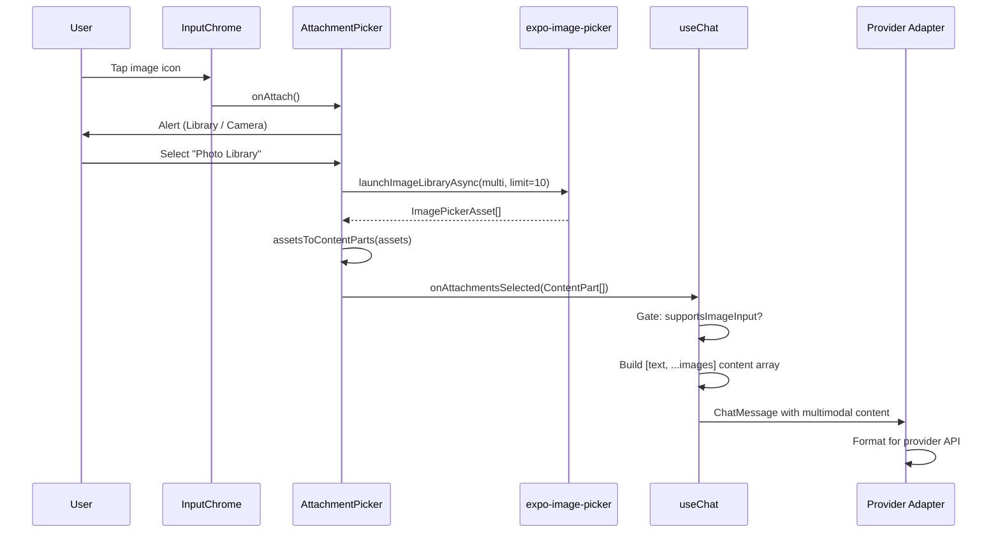

# Design Document: Image Multimodal

## Overview

This feature upgrades the existing `AttachmentPicker` to support multi-image selection from the photo library (up to 10 images), replaces the paperclip icon with a mountain/landscape image SVG icon, and ensures proper base64 encoding for both OpenAI and Anthropic providers. Camera capture is already partially implemented and needs the quality/mode constraints enforced.

The scope is intentionally narrow: the existing attachment flow (`onAttach` handler → `AttachmentPicker` → `onAttachmentsSelected` → `sendMessage`) stays the same. We're fixing up the picker options, adding the multi-select path, swapping the icon, and adding the `supportsImageInput` gate in `useChat`.

## Architecture

The data flow for image attachment is:

```
User taps Image Icon (InputChrome)
  → onAttach() fires
  → AttachmentPicker shows Alert (Photo Library / Camera)
  → expo-image-picker returns ImagePickerAsset[]
  → assetsToContentParts() encodes each as data:mime;base64,data
  → onAttachmentsSelected(ContentPart[]) called
  → ChatShell passes attachments to sendMessage(text, attachments)
  → useChat gates on model.supportsImageInput
  → builds multimodal ChatMessage with [text_part, ...image_parts]
  → provider adapter formats for target API
```

No new services, stores, or navigation routes are introduced. The changes touch:

1. `src/components/layout/InputChrome.tsx` — swap PaperclipIcon → ImageIcon
2. `src/components/chat/AttachmentPicker.tsx` — enable multi-select, enforce limits
3. `src/hooks/useChat.ts` — add `supportsImageInput` validation gate
4. `src/components/icons/ImageIcon.tsx` — new icon component (optional, can stay inline)



## Components and Interfaces

### ImageIcon (new, inline in InputChrome or extracted)

```typescript
// Mountain/landscape SVG icon matching existing IconProps pattern
interface IconProps {
  size?: number;   // default: 20 (matches PaperclipIcon usage in InputChrome)
  color?: string;  // default: '#8E8E93'
}
```

The icon is a simple mountain-with-sun landscape SVG. Since InputChrome already defines PaperclipIcon inline (not exported), the ImageIcon replaces it inline in the same file. No new file needed.

### AttachmentPicker changes

```typescript
// Existing interface — unchanged
export interface AttachmentPickerProps {
  supportsImageInput: boolean;
  supportsFileInput: boolean;
  onAttachmentsSelected: (parts: ContentPart[]) => void;
  disabled?: boolean;
}
```

Changes to internal behavior:
- `pickImageFromLibrary()`: set `allowsMultipleSelection: true`, `selectionLimit: 10`
- Loop over all `result.assets` instead of taking only `result.assets[0]`
- `assetToContentParts` renamed to `assetsToContentParts` (handles array)
- Failed assets are skipped silently (try/catch per asset)

### useChat sendMessage gate

```typescript
// Before building the multimodal message, check model capability:
if (attachments && attachments.length > 0) {
  if (!modelConfig.supportsImageInput) {
    setError({
      message: 'Active model does not support image input',
      isRetryable: false,
    });
    return;
  }
}
```

### ContentPart (existing, unchanged)

```typescript
export type ContentPart =
  | { type: 'text'; text: string }
  | { type: 'image_url'; image_url: { url: string } };
```

### Anthropic format conversion (already implemented)

The `formatMessage` function in `anthropic-provider.ts` already converts `image_url` parts to Anthropic's `{type: 'image', source: {type: 'url', url}}` format. No changes needed.

## Data Models

No new database tables or schema changes. Images are encoded inline as base64 data URIs within the `ContentPart` structure and passed ephemerally through the message pipeline. They are stored in the message `content` field as part of the serialized message.

The existing `Message` table's `content` column (TEXT) already stores the stringified message content. When a message contains multimodal parts, the content stored is the text portion only (the current `addMessage` call uses `messageContent` which is the text string). Image data is sent to the provider but not persisted to the database — this is consistent with the current behavior.

### Data URI format

```
data:image/jpeg;base64,/9j/4AAQSkZJRg...
data:image/png;base64,iVBORw0KGgo...
data:image/webp;base64,UklGRl4FA...
```

MIME type comes from `asset.mimeType` (reported by expo-image-picker), defaulting to `image/jpeg` when unavailable.

## Correctness Properties

*A property is a characteristic or behavior that should hold true across all valid executions of a system — essentially, a formal statement about what the system should do. Properties serve as the bridge between human-readable specifications and machine-verifiable correctness guarantees.*

### Property 1: Asset encoding produces valid data URIs

*For any* array of ImagePicker assets where each asset has either a non-null `base64` field or a readable `uri`, the `assetsToContentParts` function SHALL produce an array of `image_url` ContentParts where each `image_url.url` matches the regex `^data:image/[a-z]+;base64,[A-Za-z0-9+/=]+$`.

**Validates: Requirements 2.1, 4.5**

### Property 2: Encoding preserves selection order and skips failures

*For any* array of ImagePicker assets containing a mix of valid assets (with base64 data or readable URI) and invalid assets (no base64, no URI), `assetsToContentParts` SHALL return ContentParts corresponding only to the valid assets, in their original relative order, with length equal to the count of valid assets in the input.

**Validates: Requirements 1.2, 2.3**

### Property 3: Message content structure — text before images

*For any* non-empty text string and any non-empty array of `image_url` ContentParts, the constructed message content array SHALL have exactly one text part at index 0, followed by all image parts in their original order, with total length equal to 1 + number of images. When text is empty, the array SHALL contain only the image parts.

**Validates: Requirements 4.2, 4.3**

### Property 4: MIME type defaults to image/jpeg

*For any* ImagePicker asset where `mimeType` is null or undefined, the resulting data URI SHALL use `image/jpeg` as the MIME type component.

**Validates: Requirements 2.1, 5.2**

## Error Handling

| Condition | Behavior |
|-----------|----------|
| Photo library permission denied | Alert with explanation. No callback invoked. |
| Camera permission denied | Alert with explanation. Camera not launched. |
| User cancels picker/camera | No action, no callback, no error. |
| Single asset fails to encode | Skip silently, continue with remaining assets. |
| All assets fail to encode | Empty array — no callback invoked (no content parts). |
| Model doesn't support image input | Non-retryable `ChatError` surfaced before send attempt. |
| Base64 not available on asset | Fallback to `FileSystem.readAsStringAsync` from URI. |
| FileSystem read throws | Treat as failed asset (skip). |

Error messages use existing i18n keys where possible (`attachments.permissionDenied`, `attachments.libraryPermissionMessage`, `attachments.cameraPermissionMessage`).

## Testing Strategy

### Unit Tests (example-based)

- **AttachmentPicker**: Verify `launchImageLibraryAsync` called with `allowsMultipleSelection: true, selectionLimit: 10`
- **AttachmentPicker**: Permission denied paths show correct alerts
- **AttachmentPicker**: Cancelled picker produces no callback invocation
- **AttachmentPicker**: Camera launched with `mediaTypes: ['images'], quality: 0.8`
- **InputChrome**: Renders mountain/landscape SVG icon (not paperclip)
- **InputChrome**: Attachment button preserves accessibility label
- **useChat**: Rejects send with `supportsImageInput: false` and surfaces non-retryable error
- **Anthropic adapter**: `formatMessage` converts `image_url` ContentPart to Anthropic image block

### Property-Based Tests (fast-check)

Property-based tests use `fast-check` (already installed). Each test runs minimum 100 iterations.

- **Property 1**: Generate random arrays of mock ImagePicker assets with varying base64/URI availability and MIME types. Assert all outputs match data URI regex.
  - Tag: `Feature: image-multimodal, Property 1: Asset encoding produces valid data URIs`
- **Property 2**: Generate mixed arrays of valid/invalid assets. Assert output length equals valid count and order is preserved.
  - Tag: `Feature: image-multimodal, Property 2: Encoding preserves selection order and skips failures`
- **Property 3**: Generate random text strings (including empty) and random image ContentPart arrays. Assert structural invariant (text first, then images, correct length).
  - Tag: `Feature: image-multimodal, Property 3: Message content structure — text before images`
- **Property 4**: Generate assets with null/undefined mimeType. Assert output data URI contains `image/jpeg`.
  - Tag: `Feature: image-multimodal, Property 4: MIME type defaults to image/jpeg`

### What's NOT tested with PBT

- Native picker behavior (platform concern)
- Permission flows (mocked in example tests)
- UI rendering of the icon (snapshot or visual test)
- Alert dialog display (example test with Alert mock)
