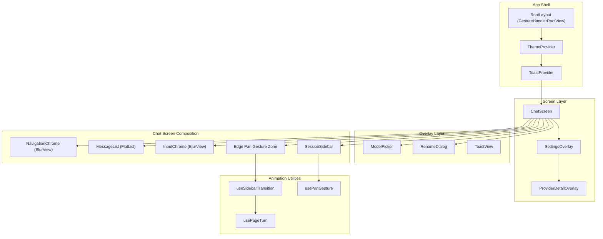

# Design Document: Mockup UI Implementation

## Overview

This design specifies the full UI rebuild of Arlo Lite to match the interactive HTML prototype. The current implementation uses a basic FlatList-based chat with chat bubble styling and a navigation-drawer sidebar. The target is a prototype-faithful UI with: full-width flowing message text, a 3D page-turn sidebar transition, translucent chrome bars, accent-hue code highlighting, gesture-driven interactions, and expressive motion.

The implementation keeps the existing Zustand stores (session-store, chat-store, provider-store) and SQLite persistence layer intact. Changes are primarily in the component/screen layer and a new animation utilities module.

**Key Technical Decisions:**

| Decision | Choice | Rationale |
|----------|--------|-----------|
| Sidebar transition | react-native-reanimated worklets + Gesture.Pan() | 60fps on UI thread; `perspective` + `rotateY` transforms match prototype |
| Blur/vibrancy bars | expo-blur `BlurView` with `systemUltraThinMaterial` tint | Native iOS vibrancy; falls back to semi-transparent fill on Android |
| Icon system | Inline SVG via react-native-svg | Prototype defines exact SVG paths; no icon library needed |
| Markdown | react-native-markdown-display with custom rules | Already in use; extend with accent-hue code inline styling |
| Syntax highlighting | react-syntax-highlighter with custom Prism theme | Accent-derived token colors; dark-only background |
| Toast system | Global ToastProvider + Animated.View overlay | Shared across all screens; non-blocking pointer events |
| Gesture composition | Gesture.Exclusive / Gesture.Simultaneous | Edge-pan for sidebar; row-pan for swipe-delete; long-press for rename |
| Model picker | Animated overlay anchored above input | Avoids navigation stack; dismiss on tap-outside |
| Settings/Provider detail | Overlay screens with animated translateX | Matches prototype's slide-from-right pattern; no router push |

## Architecture



### Layer Stack (z-index ordering)

1. **Sidebar** (z=1) — Session list, always rendered, visibility via transforms
2. **Chat Layer** (z=2) — Messages + chrome bars, 3D-transformed during sidebar open
3. **Model Picker** (z=7) — Scrim + dropdown card
4. **Settings** (z=8) — Full-screen slide-from-right overlay
5. **Provider Detail** (z=9) — Slides over settings
6. **Rename Dialog** (z=9) — Modal card + scrim
7. **Toast** (z=10) — Non-interactive floating pill

## Components and Interfaces

### Core Layout Components

```typescript
// src/components/layout/ChatShell.tsx
interface ChatShellProps {
  children: React.ReactNode;
}
// Wraps the entire chat screen: sidebar + chat layer + overlays
// Manages sidebar open/close state and gesture zone

// src/components/layout/NavigationChrome.tsx
interface NavigationChromeProps {
  title: string;
  onSidebarToggle: () => void;
  onSettingsOpen: () => void;
}
// Top bar: BlurView + sidebar button + title + settings button

// src/components/layout/InputChrome.tsx
interface InputChromeProps {
  activeModelName: string;
  thinkingLevel: ThinkingLevel;
  supportsThinking: boolean;
  contextUsagePercent: number;
  isStreaming: boolean;
  onModelPickerOpen: () => void;
  onThinkingCycle: () => void;
  onSend: (text: string) => void;
  onStop: () => void;
  onAttach: () => void;
}
// Bottom bar: BlurView + model chip + thinking bars + context ring + input + send/stop
```

### Message Components

```typescript
// src/components/chat/MessageFlow.tsx
interface MessageFlowProps {
  message: Message;
  modelName: string;
  showAvatars: boolean;
  isStreaming: boolean;
  onCopy: () => void;
  onRegenerate: () => void;
  onEdit: () => void;
  onDelete: () => void;
}
// Full-width flowing text with sender label row, metadata, and action buttons

// src/components/chat/StreamingMessage.tsx
interface StreamingMessageProps {
  content: string;
  thinkingContent: string;
  isThinking: boolean;
  modelName: string;
  tokenRate: number;
  showAvatars: boolean;
}
// Active streaming state: blinking cursor, thinking disclosure, token rate

// src/components/chat/CodePanel.tsx
interface CodePanelProps {
  code: string;
  language?: string;
}
// Fixed dark background, accent-derived syntax highlighting, copy button

// src/components/chat/ThinkingDisclosure.tsx
interface ThinkingDisclosureProps {
  content: string;
  isExpanded: boolean;
  onToggle: () => void;
}
// Blinking "Thinking" label + chevron + collapsible reasoning block
```

### Sidebar Components

```typescript
// src/components/sidebar/SessionSidebar.tsx
interface SessionSidebarProps {
  sessions: Session[];
  activeSessionId: string | null;
  onSessionSelect: (id: string) => void;
  onSessionDelete: (id: string) => void;
  onSessionRename: (id: string) => void;
  onNewChat: () => void;
}

// src/components/sidebar/SessionRow.tsx
interface SessionRowProps {
  session: Session;
  isActive: boolean;
  onSelect: () => void;
  onDelete: () => void;
  onRename: () => void;
}
// Swipeable row with delete reveal + long-press rename trigger
```

### Overlay Components

```typescript
// src/components/overlays/ModelPicker.tsx
interface ModelPickerProps {
  visible: boolean;
  models: ModelConfig[];
  activeModelId: string | null;
  onSelect: (providerId: string, modelId: string) => void;
  onDismiss: () => void;
}

// src/components/overlays/RenameDialog.tsx
interface RenameDialogProps {
  visible: boolean;
  currentTitle: string;
  onSave: (newTitle: string) => void;
  onCancel: () => void;
}

// src/components/overlays/ToastProvider.tsx
interface ToastContextValue {
  show: (message: string) => void;
}
// Global context + animated overlay pill

// src/components/overlays/SettingsScreen.tsx
interface SettingsScreenProps {
  visible: boolean;
  onClose: () => void;
}

// src/components/overlays/ProviderDetailScreen.tsx
interface ProviderDetailScreenProps {
  visible: boolean;
  providerId: string;
  onClose: () => void;
}
```

### Animation Hooks

```typescript
// src/hooks/useSidebarTransition.ts
interface SidebarTransitionResult {
  progress: SharedValue<number>;      // 0 = closed, 1 = open
  isOpen: SharedValue<boolean>;
  chatAnimatedStyle: AnimatedStyle;    // rotateY, translateX, shadow, borderRadius
  sidebarAnimatedStyle: AnimatedStyle; // translateX, scale, opacity
  panGesture: GestureType;            // Edge pan gesture (left 24px zone)
  open: () => void;
  close: () => void;
  toggle: () => void;
}

// src/hooks/useSwipeToDelete.ts
interface SwipeToDeleteResult {
  translateX: SharedValue<number>;
  panGesture: GestureType;
  isRevealed: boolean;
  reset: () => void;
}

// src/hooks/useStreamingMetrics.ts
interface StreamingMetricsResult {
  tokenRate: number;           // Rolling 2s window average, updated every 500ms
  isStalled: boolean;          // True when 0 tok/s for > 3s
  totalInputTokens: number;
  totalOutputTokens: number;
}
```

### Input Subcomponents

```typescript
// src/components/input/ModelChip.tsx
interface ModelChipProps {
  modelName: string;
  onPress: () => void;
}
// Pill button: accent tint background, model name, chevron

// src/components/input/ThinkingLevelSelector.tsx
interface ThinkingLevelSelectorProps {
  level: ThinkingLevel;
  onCycle: () => void;
}
// 5-bar equalizer with filled = active level

// src/components/input/ContextRing.tsx
interface ContextRingProps {
  percentage: number;  // 0-100
  animated?: boolean;  // Trigger scale pop on threshold cross
}
// SVG circle gauge: accent < 50%, orange 50-74%, red 75%+

// src/components/input/SendStopButton.tsx
interface SendStopButtonProps {
  hasText: boolean;
  isStreaming: boolean;
  onSend: () => void;
  onStop: () => void;
}
// Circular button: up-arrow or stop square, accent bg when active

// src/components/input/EqualiserAnimation.tsx
// 4 animated bars (staggered vertical scale) indicating active generation
```

## Data Models

### Extended Theme Tokens

The existing theme system needs these additions to match prototype values:

```typescript
// Additions to ColorPalette
interface ColorPaletteExtensions {
  /** Context ring warning (50-74%) */
  contextWarning: string;      // orange: light '#FF9500', dark '#FFD60A'
  /** Context ring critical (75%+) */
  contextCritical: string;     // red: same as error
  /** Code block fixed background */
  codeBlockBackground: string; // '#15151b' (both modes)
  /** Code keyword color (accent 62% mix with white) */
  codeKeyword: string;
  /** Code string color (accent 30% mix with white) */
  codeString: string;
  /** Code type color (accent 45% mix with #cfd0ff) */
  codeType: string;
  /** Code comment color (reduced opacity text) */
  codeComment: string;
}

// Additions to BorderRadii
interface BorderRadiiExtensions {
  /** Code block corners */
  codeBlock: number;   // 10
  /** Input field corners */
  input: number;       // 17
  /** Card corners */
  card: number;        // 12 (same as lg)
}
```

### Session Grouping

```typescript
// src/utils/session-grouping.ts
interface SessionGroup {
  label: string;  // "Today" | "Yesterday" | "This Week" | "This Month" | "Older"
  sessions: Session[];
}

function groupSessionsByDate(sessions: Session[]): SessionGroup[];
```

### Toast State

```typescript
// src/stores/ui-store.ts (new)
interface UIState {
  toastMessage: string | null;
  toastVisible: boolean;
  sidebarOpen: boolean;
  settingsVisible: boolean;
  providerDetailId: string | null;
  modelPickerVisible: boolean;
  renameSessionId: string | null;
}
```

### Streaming Metrics

```typescript
// Additions to ChatState
interface ChatStateExtensions {
  /** Timestamps of recent token arrivals for rate calculation */
  tokenTimestamps: number[];
  /** Current computed token rate (tokens/second, rolling 2s window) */
  tokenRate: number;
  /** Whether stream is stalled (0 tok/s for > 3s) */
  isStalled: boolean;
}
```

## Correctness Properties

*A property is a characteristic or behavior that should hold true across all valid executions of a system — essentially, a formal statement about what the system should do. Properties serve as the bridge between human-readable specifications and machine-verifiable correctness guarantees.*

### Property 1: Session grouping date classification

*For any* list of sessions with varying `updatedAt` timestamps, grouping them by date SHALL produce groups where every session in the "Today" group has an `updatedAt` within the current calendar day, every session in "Yesterday" is within the previous calendar day, and no session appears in more than one group.

**Validates: Requirements 7.6**

### Property 2: Thinking level cycle is a closed rotation

*For any* starting thinking level and any number N of cycle operations, applying N cycles SHALL produce the same result as applying (N mod 6) cycles, and the sequence shall be Off → Minimal → Low → Medium → High → XHigh → Off.

**Validates: Requirements 6.5**

### Property 3: Context ring color thresholds

*For any* context usage percentage between 0 and 100, the ring color SHALL be accent when percentage < 50, orange when 50 ≤ percentage < 75, and red when percentage ≥ 75.

**Validates: Requirements 6.7**

### Property 4: Send button state derivation

*For any* combination of (inputText: string, isStreaming: boolean), the send button state SHALL be: disabled when `inputText.trim() === ''` and `!isStreaming`; send-ready when `inputText.trim() !== ''` and `!isStreaming`; stop when `isStreaming` regardless of input content.

**Validates: Requirements 15.1, 15.2, 15.3**

### Property 5: Token metadata formatting round-trip

*For any* token count pair (inputTokens, outputTokens) and price pair (inputPrice, outputPrice), formatting as "Xk in / Yk out · $Z.ZZZ" and parsing back SHALL preserve the original values within rounding tolerance (counts abbreviated at ≥1000 as "X.Xk", cost to 3 decimal places).

**Validates: Requirements 1.4**

### Property 6: Sidebar snap threshold

*For any* drag release progress value between 0.0 and 1.0, the sidebar SHALL snap open if progress ≥ 0.4 (button-triggered) or ≥ 0.22 (gesture-triggered), and snap closed otherwise.

**Validates: Requirements 7.1, 14.5, 14.6**

### Property 7: Toast replacement resets timer

*For any* sequence of toast triggers, if a new toast is triggered while an existing toast is visible, the displayed message SHALL be the most recently triggered message and the dismiss timer SHALL be exactly 1.8 seconds from the moment of the last trigger.

**Validates: Requirements 12.5**

### Property 8: Rename dialog validation

*For any* string input to the rename dialog, the Save button SHALL be disabled if and only if the trimmed input is empty, and when Save is enabled the persisted title SHALL equal the trimmed input value.

**Validates: Requirements 11.5, 11.6**

### Property 9: Code panel accent-derived color consistency

*For any* app accent color, the code syntax colors (keyword, string, type, comment) SHALL be deterministically derived from the accent using fixed mix ratios, and the code block background SHALL remain `#15151b` regardless of theme mode.

**Validates: Requirements 2.4, 2.8**

### Property 10: Streaming token rate rolling window

*For any* sequence of token arrival timestamps, the computed token rate SHALL equal the count of tokens received in the most recent 2-second window divided by the window duration, recalculated every 500ms.

**Validates: Requirements 4.2**

## Error Handling

| Scenario | Handling |
|----------|----------|
| Sidebar gesture conflict with scroll | `Gesture.Exclusive()` prioritizes edge-pan when originating within 24px left zone; vertical scrolling takes precedence outside |
| Model picker opens with zero models | Show empty state message directing user to settings |
| Token rate calculation with no tokens | Display "0 tok/s"; after 3s of zero, display "stalled" |
| Rename save with whitespace-only input | Disable Save button; prevent form submission |
| Context ring exceeds 100% | Clamp to 100%; display toast "Context full" |
| Code block language unrecognized | Hide language label; render plain monospace text without highlighting |
| Settings overlay + sidebar both open | Settings overlay renders above sidebar (z=8 vs z=1); sidebar auto-closes when settings opens |
| BlurView unavailable (Android fallback) | Use semi-transparent solid background color matching the prototype's `color-mix(76% bg, transparent)` |
| Toast message exceeds 50 characters | Truncate with trailing ellipsis |
| Network disconnection during streaming | Existing error-classifier handles this; cursor/equalizer stop within 300ms |

## Testing Strategy

### Unit Tests

- **Session grouping**: Verify date boundary classification with fixed timestamps
- **Token formatting**: Verify abbreviation rules (1000→"1k", 1500→"1.5k")
- **Thinking level cycle**: Verify full rotation and wrap-around
- **Context ring color**: Verify threshold boundaries
- **Send button state**: Verify all state combinations
- **Rename validation**: Verify whitespace-only rejection
- **Toast timer**: Verify replacement behavior resets timer

### Property-Based Tests

Property-based testing IS applicable to this feature for the pure logic components (session grouping, token formatting, state derivation, color thresholds). The UI rendering and animation aspects are better covered by snapshot tests.

**Library**: fast-check (already in devDependencies)
**Configuration**: Minimum 100 iterations per property test
**Tag format**: `Feature: mockup-ui-implementation, Property {N}: {description}`

Properties 1–10 above SHALL each be implemented as a single property-based test using fast-check arbitraries to generate random inputs across the valid input space.

### Integration Tests

- Sidebar gesture → transition state → visual output (snapshot)
- Send message flow → streaming state → cursor visibility
- Model picker selection → chat store update → chip label update
- Settings screen open/close → overlay visibility

### Snapshot Tests

- NavigationChrome in light and dark modes
- InputChrome with various states (empty, has text, streaming)
- CodePanel with syntax highlighting
- MessageFlow user vs assistant rendering
- Toast appearance and positioning
