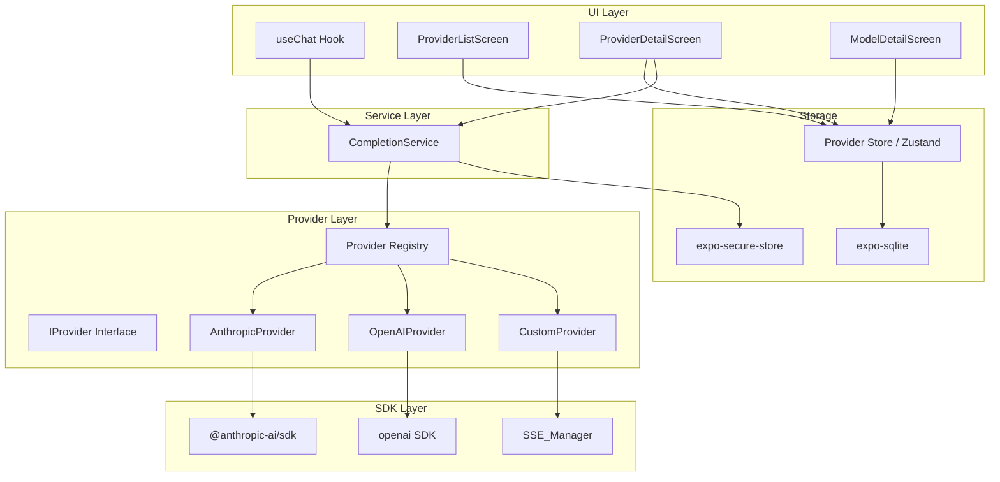
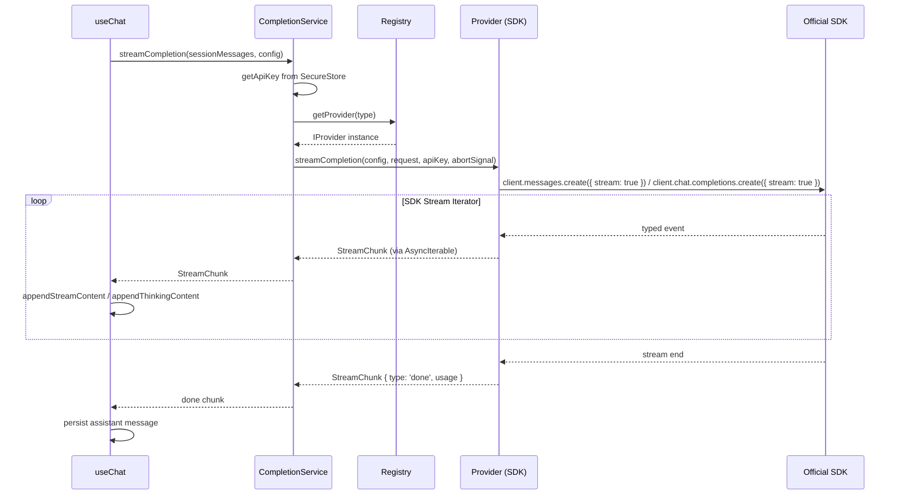
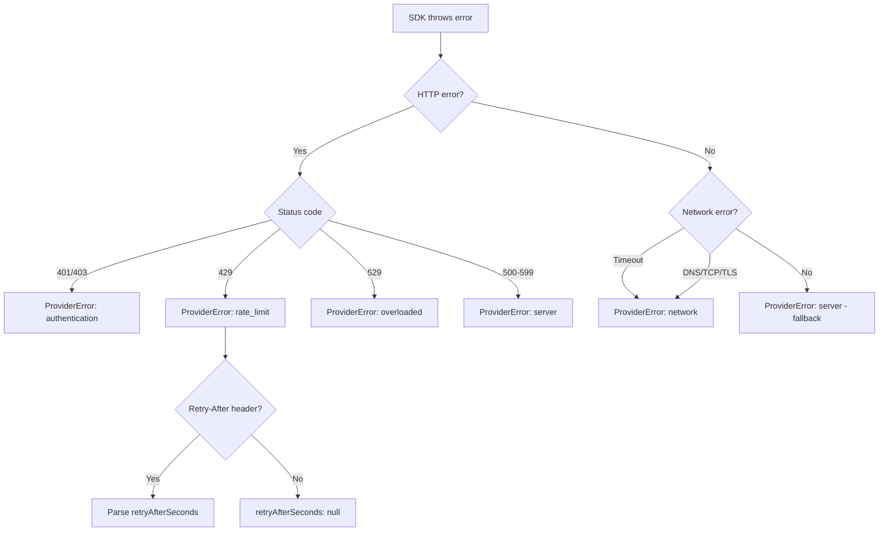

# Design Document: SDK Provider Integration

## Overview

This design replaces the manual HTTP fetch + SSE line-parsing implementations in AnthropicProvider and OpenAIProvider with their official TypeScript SDKs (`@anthropic-ai/sdk` and `openai`). The SDKs handle authentication, request construction, streaming iteration, error classification, and retries — eliminating hand-rolled SSE parsing and improving API compatibility. The Custom provider retains raw fetch + SSE_Manager for arbitrary OpenAI-compatible endpoints.

The refactoring also introduces:
- A simplified `IProvider` interface with `complete` and `streamCompletion` as sole entry points
- A `ProviderError` type with structured error categories
- A `CompletionService` that mediates between hooks and provider adapters
- UI enhancements for connection status indicators and "Test Connection" flows

### Design Decisions

| Decision | Rationale |
|----------|-----------|
| SDK streaming via AsyncIterable | Both SDKs return async iterables natively; aligns with modern JS patterns and simplifies backpressure handling |
| Keep SSE_Manager for CustomProvider only | Custom endpoints are arbitrary; we cannot assume SDK compatibility |
| Lazy SDK client construction | Avoids importing/initializing SDK until first use; keeps app startup fast |
| Client instance caching keyed by (apiKey, baseUrl) | Avoids recreating clients on every request while correctly invalidating when credentials change |
| ProviderError with category enum | Enables UI-layer branching (show retry vs "check key") without inspecting HTTP codes |
| CompletionService as thin orchestrator | Decouples useChat from provider internals; testable without UI |

## Architecture



### Data Flow: Streaming Completion



## Components and Interfaces

### Refactored IProvider Interface

```typescript
/**
 * Common provider interface — SDK-based and raw-fetch providers
 * both implement this contract.
 */
export interface IProvider {
  readonly type: ProviderType;

  /**
   * Execute a non-streaming completion request.
   *
   * @param config - Provider configuration (baseUrl, apiMode, etc.)
   * @param request - The completion request parameters
   * @param apiKey - API key for authentication
   * @returns Parsed CompletionResponse
   * @throws ProviderError on auth, network, or server failures
   */
  complete(
    config: ProviderConfig,
    request: CompletionRequest,
    apiKey: string,
  ): Promise<CompletionResponse>;

  /**
   * Execute a streaming completion request.
   *
   * Returns an AsyncIterable that yields StreamChunks as they arrive.
   * The iterable terminates with a 'done' chunk on success or an 'error'
   * chunk on failure.
   *
   * @param config - Provider configuration
   * @param request - The completion request parameters
   * @param apiKey - API key for authentication
   * @param signal - AbortSignal for cancellation
   * @returns AsyncIterable of StreamChunk objects
   */
  streamCompletion(
    config: ProviderConfig,
    request: CompletionRequest,
    apiKey: string,
    signal: AbortSignal,
  ): AsyncIterable<StreamChunk>;

  /**
   * List available models from the provider API.
   */
  listModels(config: ProviderConfig, apiKey: string): Promise<string[]>;

  /**
   * Validate an API key with a minimal request.
   */
  validateApiKey(config: ProviderConfig, apiKey: string): Promise<boolean>;
}
```

### ProviderError Type

```typescript
/**
 * Error categories for provider failures.
 * Enables UI branching without inspecting HTTP status codes.
 */
export type ProviderErrorCategory =
  | 'authentication'  // 401, 403
  | 'rate_limit'      // 429
  | 'overloaded'      // 529 (Anthropic-specific)
  | 'network'         // DNS, TCP, TLS, timeout
  | 'server';         // 500-599 (excluding 529 for Anthropic)

/**
 * Structured provider error with classification metadata.
 */
export class ProviderError extends Error {
  /** Error category for UI branching */
  readonly category: ProviderErrorCategory;
  /** Seconds to wait before retrying (from Retry-After header), or null */
  readonly retryAfterSeconds: number | null;

  constructor(
    message: string,
    category: ProviderErrorCategory,
    retryAfterSeconds: number | null = null,
  ) {
    super(message);
    this.name = 'ProviderError';
    this.category = category;
    this.retryAfterSeconds = retryAfterSeconds;
  }

  /** Whether this error is potentially transient and retryable */
  get isRetryable(): boolean {
    return (
      this.category === 'rate_limit' ||
      this.category === 'overloaded' ||
      this.category === 'server' ||
      this.category === 'network'
    );
  }
}
```

### CompletionService

```typescript
/**
 * Orchestrates completion requests between the UI hook and provider adapters.
 *
 * Responsibilities:
 * - Retrieve API key from secure store
 * - Select provider via registry
 * - Invoke complete() or streamCompletion()
 * - Translate ProviderErrors into ChatErrors for UI
 */
export interface CompletionServiceOptions {
  providerId: string;
  providerConfig: ProviderConfig;
  modelId: string;
  thinkingLevel: ThinkingLevel;
}

export async function* streamCompletion(
  messages: ChatMessage[],
  options: CompletionServiceOptions,
  signal: AbortSignal,
): AsyncGenerator<StreamChunk> {
  const apiKey = await getApiKey(options.providerId);
  if (!apiKey) throw new ProviderError('API key not found', 'authentication');

  const provider = getProvider(options.providerConfig.type);
  const request: CompletionRequest = {
    messages,
    model: options.modelId,
    thinkingLevel: options.thinkingLevel,
    stream: true,
  };

  yield* provider.streamCompletion(options.providerConfig, request, apiKey, signal);
}

export async function complete(
  messages: ChatMessage[],
  options: CompletionServiceOptions,
): Promise<CompletionResponse> {
  const apiKey = await getApiKey(options.providerId);
  if (!apiKey) throw new ProviderError('API key not found', 'authentication');

  const provider = getProvider(options.providerConfig.type);
  const request: CompletionRequest = {
    messages,
    model: options.modelId,
    thinkingLevel: options.thinkingLevel,
    stream: false,
  };

  return provider.complete(options.providerConfig, request, apiKey);
}
```

### AnthropicProvider (SDK-based)

```typescript
export class AnthropicProvider implements IProvider {
  readonly type: ProviderType = 'anthropic';

  /** Cached SDK client, invalidated when key/url change */
  private client: Anthropic | null = null;
  private clientKey: string = '';
  private clientBaseUrl: string = '';

  private getClient(apiKey: string, baseUrl: string): Anthropic {
    if (this.client && this.clientKey === apiKey && this.clientBaseUrl === baseUrl) {
      return this.client;
    }
    this.client = new Anthropic({
      apiKey,
      baseURL: baseUrl,
      defaultHeaders: { 'anthropic-version': '2023-06-01' },
    });
    this.clientKey = apiKey;
    this.clientBaseUrl = baseUrl;
    return this.client;
  }

  async complete(config, request, apiKey): Promise<CompletionResponse> {
    const client = this.getClient(apiKey, config.baseUrl);
    const { system, messages } = extractSystemAndMessages(request.messages);
    const thinkingParams = mapThinkingLevelAnthropic(request.thinkingLevel);

    try {
      const response = await client.messages.create({
        model: request.model,
        messages,
        max_tokens: request.maxTokens ?? 4096,
        stream: false,
        ...(system ? { system } : {}),
        ...(thinkingParams.thinking ? { thinking: thinkingParams.thinking } : {}),
      });
      return mapAnthropicResponse(response);
    } catch (error) {
      throw classifyAnthropicError(error);
    }
  }

  async *streamCompletion(config, request, apiKey, signal): AsyncIterable<StreamChunk> {
    const client = this.getClient(apiKey, config.baseUrl);
    const { system, messages } = extractSystemAndMessages(request.messages);
    const thinkingParams = mapThinkingLevelAnthropic(request.thinkingLevel);

    try {
      const stream = client.messages.stream({
        model: request.model,
        messages,
        max_tokens: request.maxTokens ?? 4096,
        ...(system ? { system } : {}),
        ...(thinkingParams.thinking ? { thinking: thinkingParams.thinking } : {}),
      }, { signal });

      let inputTokens = 0;
      let outputTokens = 0;

      for await (const event of stream) {
        if (signal.aborted) break;
        const chunk = mapAnthropicStreamEvent(event, inputTokens, outputTokens);
        if (chunk) {
          if (chunk.type === 'done' && chunk.usage) {
            // Accumulate usage from message events
            inputTokens = chunk.usage.promptTokens;
            outputTokens = chunk.usage.completionTokens;
          }
          yield chunk;
        }
      }

      // Final done chunk with accumulated usage
      yield { type: 'done', content: '', usage: { promptTokens: inputTokens, completionTokens: outputTokens, totalTokens: inputTokens + outputTokens } };
    } catch (error) {
      if (signal.aborted) {
        yield { type: 'done', content: '' };
        return;
      }
      const classified = classifyAnthropicError(error);
      yield { type: 'error', content: `${classified.category}: ${classified.message}` };
      yield { type: 'done', content: '' };
    }
  }
}
```

### OpenAIProvider (SDK-based)

```typescript
export class OpenAIProvider implements IProvider {
  readonly type: ProviderType = 'openai';

  private client: OpenAI | null = null;
  private clientKey: string = '';
  private clientBaseUrl: string = '';

  private getClient(apiKey: string, baseUrl: string): OpenAI {
    if (this.client && this.clientKey === apiKey && this.clientBaseUrl === baseUrl) {
      return this.client;
    }
    this.client = new OpenAI({
      apiKey,
      baseURL: baseUrl,
      maxRetries: 2, // SDK handles exponential backoff for 5xx
    });
    this.clientKey = apiKey;
    this.clientBaseUrl = baseUrl;
    return this.client;
  }

  async complete(config, request, apiKey): Promise<CompletionResponse> {
    const client = this.getClient(apiKey, config.baseUrl);
    const thinkingParams = mapThinkingLevelOpenAI(request.thinkingLevel);

    try {
      if (config.apiMode === 'chat-completions') {
        const response = await client.chat.completions.create({
          model: request.model,
          messages: request.messages.map(toChatCompletionMessage),
          max_tokens: request.maxTokens,
          stream: false,
          ...(request.thinkingLevel !== 'off' ? thinkingParams : {}),
        });
        return mapChatCompletionResponse(response);
      }
      // Responses API
      const response = await client.responses.create({
        model: request.model,
        input: convertToResponsesInput(request.messages),
        max_output_tokens: request.maxTokens,
        stream: false,
        ...(request.thinkingLevel !== 'off' ? { reasoning: { effort: thinkingParams.reasoning_effort } } : {}),
      });
      return mapResponsesResponse(response);
    } catch (error) {
      throw classifyOpenAIError(error);
    }
  }

  async *streamCompletion(config, request, apiKey, signal): AsyncIterable<StreamChunk> {
    if (signal.aborted) {
      yield { type: 'error', content: 'Request cancelled' };
      return;
    }

    const client = this.getClient(apiKey, config.baseUrl);
    const thinkingParams = mapThinkingLevelOpenAI(request.thinkingLevel);

    try {
      if (config.apiMode === 'chat-completions') {
        yield* this.streamChatCompletions(client, request, thinkingParams, signal);
      } else {
        yield* this.streamResponses(client, request, thinkingParams, signal);
      }
    } catch (error) {
      if (signal.aborted) {
        yield { type: 'done', content: '' };
        return;
      }
      const classified = classifyOpenAIError(error);
      yield { type: 'error', content: `${classified.category}: ${classified.message}` };
      yield { type: 'done', content: '' };
    }
  }
}
```

### CustomProvider (SSE_Manager-based)

```typescript
export class CustomProvider implements IProvider {
  readonly type: ProviderType = 'custom';

  async complete(config, request, apiKey): Promise<CompletionResponse> {
    // Build request using existing openai-chat helpers
    const { url, headers, body } = buildChatCompletionsRequest(config, request, mapThinkingLevelOpenAI(request.thinkingLevel), apiKey);
    const response = await fetch(url, { method: 'POST', headers, body });
    if (!response.ok) throw classifyHttpError(response.status);
    return parseChatCompletionsResponse(await response.json());
  }

  async *streamCompletion(config, request, apiKey, signal): AsyncIterable<StreamChunk> {
    const { url, headers, body } = buildChatCompletionsRequest(config, request, mapThinkingLevelOpenAI(request.thinkingLevel), apiKey);

    // Bridge SSE_Manager callback pattern to AsyncIterable
    const chunks: StreamChunk[] = [];
    let resolve: (() => void) | null = null;
    let done = false;

    const connection = createSSEStream(url, headers, body, this.legacyParser, {
      onChunk: (chunk) => { chunks.push(chunk); resolve?.(); },
      onComplete: (usage) => { chunks.push({ type: 'done', content: '', usage }); done = true; resolve?.(); },
      onError: (err) => { chunks.push({ type: 'error', content: err.message }); done = true; resolve?.(); },
    });

    signal.addEventListener('abort', () => connection.abort());

    while (!done) {
      if (chunks.length > 0) {
        yield chunks.shift()!;
      } else {
        await new Promise<void>((r) => { resolve = r; });
      }
    }
    // Drain remaining chunks
    while (chunks.length > 0) yield chunks.shift()!;
  }
}
```

### Provider Registry (unchanged signature)

```typescript
// src/providers/registry.ts — signature preserved
export function getProvider(type: ProviderType): IProvider { ... }
export function clearProviderCache(): void { ... }
```

The registry continues to use lazy singletons. Existing call sites remain unchanged.

## Data Models

### Connection Status (Provider Store extension)

```typescript
export type ConnectionStatus = 'untested' | 'connected' | 'failed';

export interface ProviderConnectionState {
  status: ConnectionStatus;
  error?: string;        // Short error message when status === 'failed'
  lastTestedAt?: number; // Unix timestamp ms
}

// Added to ProviderStore
interface ProviderStore {
  // ... existing fields ...
  connectionStatuses: Record<string, ProviderConnectionState>;
  testConnection: (providerId: string) => Promise<void>;
}
```

### Model Cache (for offline fallback)

```typescript
// Stored in expo-sqlite models_cache table
interface CachedModelList {
  providerId: string;
  modelIds: string; // JSON-serialized string[]
  fetchedAt: number; // Unix timestamp ms
}
```

### Updated StreamChunk (unchanged)

The existing `StreamChunk` interface remains as-is. The SDK providers map their typed events into this format:

```typescript
export interface StreamChunk {
  type: 'text' | 'thinking' | 'done' | 'error';
  content: string;
  usage?: TokenUsage;
}
```

### SDK Client Configuration

```typescript
// Anthropic client options
{
  apiKey: string;
  baseURL: string;
  defaultHeaders: { 'anthropic-version': '2023-06-01' };
  // fetch: globalThis.fetch (React Native's built-in)
}

// OpenAI client options
{
  apiKey: string;
  baseURL: string;
  maxRetries: 2;          // Exponential backoff for 5xx
  timeout: 60_000;        // 60s request timeout
  dangerouslyAllowBrowser: true; // Required for RN (non-Node env)
  // fetch: globalThis.fetch (React Native's built-in)
}
```

## Correctness Properties

*A property is a characteristic or behavior that should hold true across all valid executions of a system — essentially, a formal statement about what the system should do. Properties serve as the bridge between human-readable specifications and machine-verifiable correctness guarantees.*

### Property 1: Anthropic request parameter mapping

*For any* CompletionRequest with arbitrary model, messages (including 0 or more system-role messages), optional maxTokens, and any ThinkingLevel, the AnthropicProvider SHALL produce SDK parameters where: the `system` field equals the concatenation of all system-role message texts, the `messages` array excludes all system-role messages, `max_tokens` equals request.maxTokens or 4096 when undefined, and `thinking` matches the output of mapThinkingLevelAnthropic.

**Validates: Requirements 1.1, 1.6**

### Property 2: Anthropic non-streaming response mapping

*For any* Anthropic SDK response containing N text-type content blocks and 0 or 1 thinking-type content blocks with arbitrary usage values (input_tokens, output_tokens) and stop_reason, the mapped CompletionResponse SHALL have content equal to the concatenation of all text block texts, thinkingContent equal to the thinking block text (or undefined), usage.promptTokens/completionTokens matching input_tokens/output_tokens, and finishReason matching stop_reason.

**Validates: Requirements 1.3**

### Property 3: Anthropic stream event-to-chunk mapping

*For any* content_block_delta event, if `delta.type` is 'text_delta' then the emitted StreamChunk SHALL have type 'text' with content matching `delta.text`, and if `delta.type` is 'thinking_delta' then the emitted StreamChunk SHALL have type 'thinking' with content matching `delta.thinking`. Events with any other `delta.type` SHALL not emit a StreamChunk.

**Validates: Requirements 2.3, 2.4**

### Property 4: Anthropic stream usage accumulation

*For any* stream session where a `message_start` event reports N input_tokens and a `message_delta` event reports M output_tokens, the final 'done' StreamChunk SHALL have usage.promptTokens === N, usage.completionTokens === M, and usage.totalTokens === N + M.

**Validates: Requirements 2.5**

### Property 5: Unrecognized stream events are silently skipped

*For any* sequence of SDK stream events where some events have unrecognized types interspersed with valid events, the stream output SHALL contain StreamChunks only for the valid events, in order, with no interruption to subsequent event processing.

**Validates: Requirements 2.8**

### Property 6: Streaming and non-streaming parameter consistency

*For any* CompletionRequest, the parameters passed to the SDK method (model, messages, max_tokens, system, thinking configuration) SHALL be identical between the streaming and non-streaming code paths, differing only in the `stream` flag.

**Validates: Requirements 2.9**

### Property 7: Anthropic error classification

*For any* SDK error with HTTP status code, the resulting ProviderError SHALL have category 'authentication' for 401/403, 'rate_limit' for 429, 'overloaded' for 529, 'server' for 500-599 (excluding 529), and 'network' for connection/DNS/timeout failures. The ProviderError message SHALL not expose raw API response bodies.

**Validates: Requirements 1.4, 7.1**

### Property 8: OpenAI request parameter mapping

*For any* CompletionRequest with arbitrary model, messages, optional maxTokens, and any ThinkingLevel, when the provider is in chat-completions mode the SDK call SHALL include `reasoning_effort` only when ThinkingLevel is not 'off', and when in responses mode the SDK call SHALL include `reasoning.effort` only when ThinkingLevel is not 'off'. All other parameters SHALL be correctly mapped from the CompletionRequest regardless of mode.

**Validates: Requirements 3.1, 3.2**

### Property 9: OpenAI non-streaming response mapping

*For any* OpenAI SDK response (either chat completions or responses format) containing content text, optional reasoning content, token usage (prompt, completion, total, cached), and a finish reason, the mapped CompletionResponse SHALL preserve all fields with correct type mappings.

**Validates: Requirements 3.4**

### Property 10: OpenAI stream event-to-chunk mapping

*For any* OpenAI streaming event, if the event contains `delta.content` (chat-completions) or is a `response.output_text.delta` event (responses), the emitted StreamChunk SHALL have type 'text'; if the event contains `delta.reasoning_content` (chat-completions) or is a `response.reasoning.delta` event (responses), the emitted StreamChunk SHALL have type 'thinking'. The content field SHALL match the delta string in all cases.

**Validates: Requirements 4.3, 4.4**

### Property 11: OpenAI stream completion with optional usage

*For any* OpenAI stream completion event, the emitted 'done' StreamChunk SHALL include usage data when the final event provides token counts, and SHALL omit the usage field when token counts are absent.

**Validates: Requirements 4.5**

### Property 12: OpenAI error classification

*For any* SDK error with HTTP status code, the resulting ProviderError SHALL have category 'authentication' for 401/403, 'rate_limit' for 429, 'server' for 500-599, and 'network' for connection/DNS/timeout failures. The ProviderError message SHALL not expose raw API response bodies.

**Validates: Requirements 3.5, 7.2**

### Property 13: Rate-limit Retry-After handling

*For any* rate-limit error (HTTP 429) with an optional Retry-After header value, the ProviderError SHALL have retryAfterSeconds set to the parsed integer value when the header is present, or null when absent. During streaming, the emitted error StreamChunk content SHALL contain the retry duration (or "unknown" when null).

**Validates: Requirements 7.3, 7.4**

### Property 14: Auth/network errors throw with correct category

*For any* authentication error (401/403) or network error during `complete` or `streamCompletion`, the provider SHALL throw a ProviderError with the corresponding category and SHALL NOT return a partial CompletionResponse or yield partial content after the error.

**Validates: Requirements 5.8**

### Property 15: Retriable errors emit error+done chunk sequence

*For any* retriable error (HTTP 429 or 5xx) occurring during `streamCompletion`, the provider SHALL yield exactly one StreamChunk of type 'error' containing the failure reason, followed by exactly one StreamChunk of type 'done', and SHALL yield no further chunks.

**Validates: Requirements 5.9**

### Property 16: Network errors during streaming emit error chunk

*For any* network failure (DNS, TCP, TLS, timeout) occurring during an active stream, the provider SHALL emit a StreamChunk of type 'error' whose content identifies the failure type, and SHALL cease further chunk emission from that stream.

**Validates: Requirements 2.7**

### Property 17: Model list alphabetical sorting

*For any* non-empty list of model IDs returned by the OpenAI models endpoint, the listModels method SHALL return those IDs in case-insensitive alphabetical order.

**Validates: Requirements 9.1**

### Property 18: Model ID length validation

*For any* string input as a manual model ID, the system SHALL accept it if and only if its length is between 1 and 256 characters (inclusive).

**Validates: Requirements 9.4**

## Error Handling

### Error Classification Strategy



### Error Handling by Context

| Context | Behavior |
|---------|----------|
| Non-streaming `complete()` | Throw ProviderError directly; SDK retries 5xx up to 2 times before throwing |
| Streaming `streamCompletion()` | Yield error StreamChunk + done StreamChunk; do not throw |
| Abort/cancel | Yield done StreamChunk (no error); release connection |
| Pre-aborted signal | Yield error StreamChunk "Request cancelled"; no network request |
| `validateApiKey()` | Return `false` on auth errors, `true` on other non-auth responses |
| `listModels()` (Anthropic) | Fall back to curated list on non-auth failures |
| `listModels()` (OpenAI) | Throw ProviderError on failure (caller handles fallback to cache) |

### Retry Strategy

- **OpenAI SDK**: `maxRetries: 2` configured at client level; exponential backoff for 5xx responses
- **Anthropic SDK**: `maxRetries: 2` configured at client level; handles 529 overloaded responses
- **Custom Provider**: No automatic retry (user-controlled endpoints with unknown behavior)
- **Rate-limit (429)**: No automatic retry; surface `retryAfterSeconds` to UI for user-facing countdown

### Error Surface in UI

- ProviderError propagates up through CompletionService to useChat hook
- useChat translates ProviderError → ChatError for the ErrorBanner component
- ErrorBanner shows: message, optional retry button (when `isRetryable`), optional countdown (rate_limit with retryAfterSeconds)
- ProviderListScreen shows connection status dot (green/red/gray) based on last validateApiKey result
- ProviderDetailScreen "Test Connection" shows inline success/error below API key field

## Testing Strategy

### Property-Based Tests (fast-check)

The project already includes `fast-check` in devDependencies. Each correctness property maps to a property-based test with minimum 100 iterations.

**Test structure:**

```
src/providers/__tests__/
  anthropic-provider.property.test.ts   — Properties 1-7, 16
  openai-provider.property.test.ts      — Properties 8-12, 16, 17
  provider-error.property.test.ts       — Properties 13-15
  model-validation.property.test.ts     — Property 18
```

**Configuration:**
- Minimum 100 iterations per property test (`fc.assert(property, { numRuns: 100 })`)
- Each test tagged: `// Feature: sdk-provider-integration, Property N: [title]`
- SDK clients mocked at the module level; tests exercise parameter mapping and response transformation logic
- Generators produce: random CompletionRequests, random SDK response objects, random HTTP status codes, random stream event sequences

**Library:** fast-check (already in devDependencies as `"fast-check": "^3.23.0"`)

### Unit Tests (Jest)

**Focus areas:**
- SDK client caching/invalidation logic
- CompletionService orchestration (mocked providers)
- CustomProvider SSE_Manager bridging to AsyncIterable
- Connection status state transitions
- UI components: ProviderCard with status indicators, Test Connection flow

### Integration Tests

- End-to-end streaming flow with mocked SDK (real AsyncIterable consumption)
- Abort/cancel mid-stream timing verification
- Model listing with network failure → cache fallback
- Provider registry lazy instantiation

### What is NOT property-tested

- UI rendering (ProviderListScreen, ProviderDetailScreen) — use snapshot + example-based tests
- SDK installation/build compatibility (Req 10) — verified by CI build
- Timing constraints (50ms event emission, 500ms abort) — integration tests
- iCloud backup interaction — outside scope of this feature
